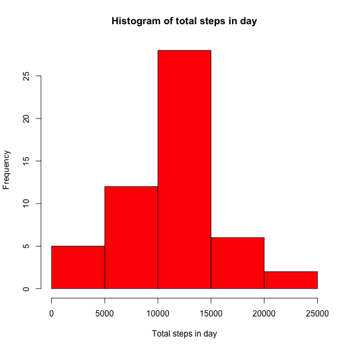
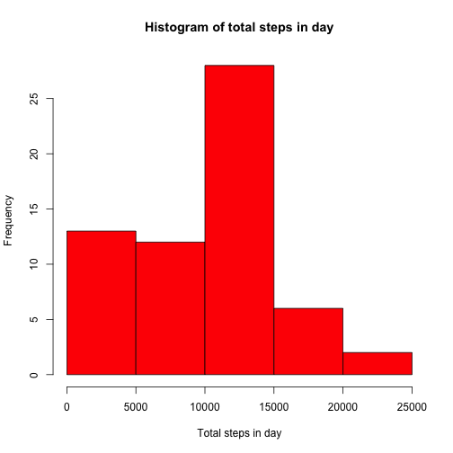
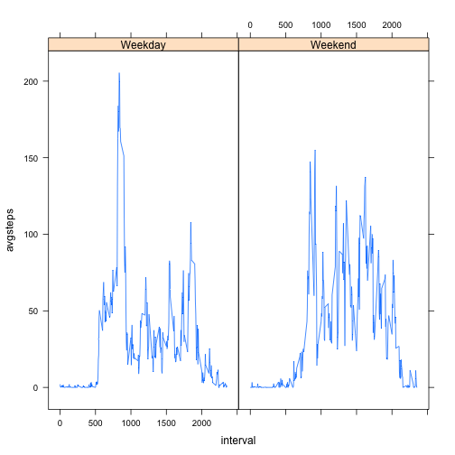

---
<<<<<<< HEAD
output: html_document
---
Reproducable Research: Peer Assessment 1
============================================


### Importing Data

The data is imported from the file "activity.csv". This file contains data on the number of steps taken over a two month period, broken down into 5 minute intervals. The data contains the following variables:
-steps: Number of steps taken in a 5 minute interval
-date: The date on which the measurement was taken
-interval: The 5 min intherval from which the measurement was taken

The data is imported as follows:


```r
data <- read.csv("activity.csv")
```

### Total number of steps taken per day

For analysis of the total number of steps taken the data is first grouped by day and summarised with sum for each day to give the total steps taken across the whole day. This is done as follows using the dplyr package.


```r
suppressMessages(library(dplyr))
Step_sum <- group_by(data, date) %>%
      summarise(daysum = sum(steps))
```

This returns the following value for the mean.


```r
mean(Step_sum$daysum, na.rm = TRUE)
```

```
## [1] 10766.19
```

And the following value for the median.


```r
median(Step_sum$daysum, na.rm = TRUE)
```

```
## [1] 10765
```

This data is then displayed in a histogram.


```r
hist(Step_sum$daysum, xlab = "Total steps in day", col = "red", main = "Histogram of total steps in day")
```

 

### Daily activity pattern

The daily interval data is now used to build an analysis of the intraday activity levels. The data is first grouped by the intervals and summarised with a mean for each interval across all days. These interval averages are then displayed in a line graph.


```r
Interval_Avg <- group_by(data, interval) %>%
      summarise(intavg = mean(steps, na.rm = TRUE))

plot(Interval_Avg$interval, Interval_Avg$intavg, type = "n", xlab = "5 min Interval", ylab = "Average steps per interval", main = "Average number of steps per interval")
lines(Interval_Avg$interval, Interval_Avg$intavg)
```

 

The interval that contains the largest average number of steps is shown below. 


```r
Interval_Avg[ match(max(Interval_Avg$intavg),Interval_Avg$intavg), 1]
```

```
## Source: local data frame [1 x 1]
## 
##   interval
## 1      835
```

### Inputing missing values

The report contains the following number of missing values.


```r
sum(is.na(data$steps))
```

```
## [1] 2304
```

To adjust for the missing values these values are filled with the average number of steps for that interval across all days, excluding the NA values. This is done with the following code, resulting in the same data but the amended NA values in the variable DT.


```r
suppressMessages(library(data.table))
DT <- data.table(data)
setkey(DT, interval)

DT[,steps := ifelse(is.na(steps), median(steps, na.rm=TRUE), steps), by=interval]
```

```
##        steps       date interval
##     1:     0 2012-10-01        0
##     2:     0 2012-10-02        0
##     3:     0 2012-10-03        0
##     4:    47 2012-10-04        0
##     5:     0 2012-10-05        0
##    ---                          
## 17564:     0 2012-11-26     2355
## 17565:     0 2012-11-27     2355
## 17566:     0 2012-11-28     2355
## 17567:     0 2012-11-29     2355
## 17568:     0 2012-11-30     2355
```

The same analysis daily analysis is then conducted with the amended data.


```r
Clean_Step_sum <- group_by(DT, date) %>%
      summarise(cleandaysum = sum(steps))

mean(Clean_Step_sum$cleandaysum, na.rm = TRUE)
```

```
## [1] 9503.869
```

```r
median(Clean_Step_sum$cleandaysum, na.rm = TRUE)
```

```
## [1] 10395
```

```r
hist(Clean_Step_sum$cleandaysum, xlab = "Total steps in day", col = "red", main = "Histogram of total steps in day")
```

 

These values differ slighly from the orignal values as the majority of the NA values have been filled with 0 or small numbers. This is seen with the increase in the first bar of the histogram.

### Activity differences between weekdays and weekends.

For this analysis the data if firstly amended to add a new variable displaying if the date is a weekend or weekday.


```r
suppressMessages(library(lubridate))
Week_Data <- mutate(DT, day = ifelse( wday(ymd(date)) == 1 | wday(ymd(date)) == 7 , "Weekend" , "Weekday" ))
head(Week_Data)
```

```
##    steps       date interval     day
## 1:     0 2012-10-01        0 Weekday
## 2:     0 2012-10-02        0 Weekday
## 3:     0 2012-10-03        0 Weekday
## 4:    47 2012-10-04        0 Weekday
## 5:     0 2012-10-05        0 Weekday
## 6:     0 2012-10-06        0 Weekend
```

A plot is then constructed to compare the activity on weekdays relatitive to weekends. This is done by grouping the data by the interval and the new day variable then summarising with average. The plots are displayed side by side using the day grouping.


```r
Weekday_avg <- group_by(Week_Data, day, interval) %>%
      summarise(avgsteps = mean(steps))

library(lattice)
xyplot(avgsteps ~ interval | day, data = Weekday_avg, type = "a")
```

 
